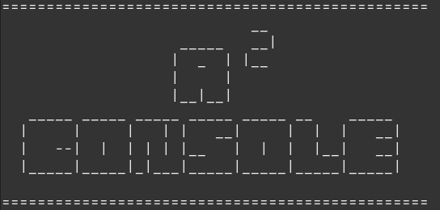
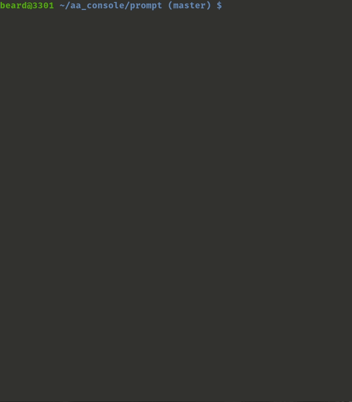

# A<sup>2</sup>Console  

A<sup>2</sup>console is a CLI tool that helps with AppArmor management; It simplifies the basic AppArmor operations and adds some custom commands (e.g. `log_search`) </br>



To have a more detailed explanation of every command and to know how to extends A<sup>2</sup>Console features please refer to the [section below](https://github.com/beard33/aa_console#extend-functionalities)</br>

## Commands
| Command | Result  |
|---      |---      |
| **List [type]** | List all profiles of selected type (_All, Enforce, Complain_)  |
|  **Search [string]** | Search for all profiles matching the selected string  |
|  **Generate [name] \<flag\>**| Generate a profile for the given element <br> Use `-m` to generate it in manual mode with vim|
|  **Log_search \<flag\>**| Search in auditd logs for __denied__ accesses (i.e. denied profiles in enforce mode) <br> Use `-d` to search only on today's logs <br> Use `-n` to specify how many days you want to go back with the search <br> `no-flag` search in **all** auditd logs|
| **Change_prof <-m> [name]**| Change the profile [name] in the specified `-m` mode <br> Use `-c` to change in Complain mode <br> Use `-e` to change in Enforce mode |


## Requirements
In order to use `aa_console` you need:
* **AppArmor** installed and enabled (please refer to the [official wiki](https://gitlab.com/apparmor/apparmor/wikis/home) for installation)
* **Ruby** installed on your system
* **Auditd** installed and enabled on your system (the `log_search` command relies on this daemon)

## Usage
The main file is the one called `./aa_console.rb` and it **must be run as sudo**. Once the program is running you have just to type `help` to get a command list with description </br>



---

## Extend functionalities
It is possible to extend A<sup>2</sup>Console functionalities adding custom commands; in order to implement your own command you have to **extend the class** `CLICommand.rb` that can be found under the _commands_ directory. <br>

It is composed by: <br>


The **constructor** :
``` ruby
def initialize(option = nil)
    parse_option(option)
end
```
And 2 mandatory methods:
* **parse_option**, which responsibility is to parse the arguments given to the command
``` ruby
def parse_option(option)
  raise NotImplementedError
end
```
* **print_help**, which responsibility is to print the command relative help when the arg is equal to _help_
``` ruby
def print_help
  raise NotImplementedError
end
```
<br>
In order to implement your own command, you've to extend this class implementing the two methods; then you can give your class the desired behavior implementing your own extra methods
